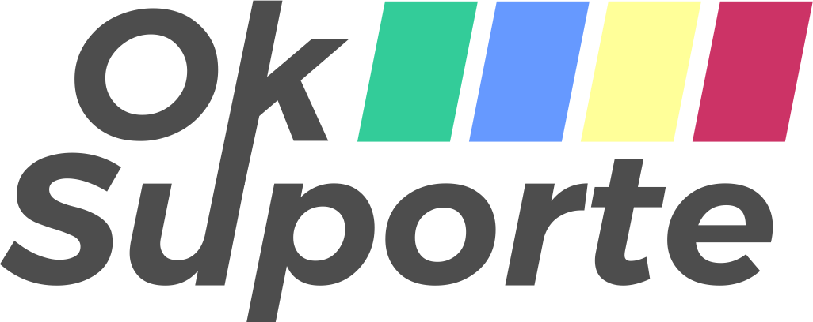

### Sobre o projeto
© OkSuporte é um sistema para controle e acompanhamento de chamados de suporte(tickets) e pedidos(ordens de serviço) para fábricas de móveis.

Esse sistema está sendo desenvolvido para praticar os conhecimentos e habilidades adquiridos durante meus primeiros passos no mundo da programação, bem como oferecer uma solução a um problema/dificuldade presente no dia a dia de muitas fábricas de móveis planejados.

###gif do projeto funcionando

###link do projeto publicado

###layout web

###layout mobile
## Tecnologias utilizadas

### Front-end

- HTML
- CSS
- Javascript


### Back-end

- Javascript
- NodeJS
- MongoDB

## Como executar o projeto

```bash
#clonar o repositório
git clone https://github.com/codigoTX/oksuporte

#instalar as dependências
npm install

# executar
npm run startdev
```

## Autor

Rafael Silva Teixeira

https://www.linkedin.com/in/rafaeltx/